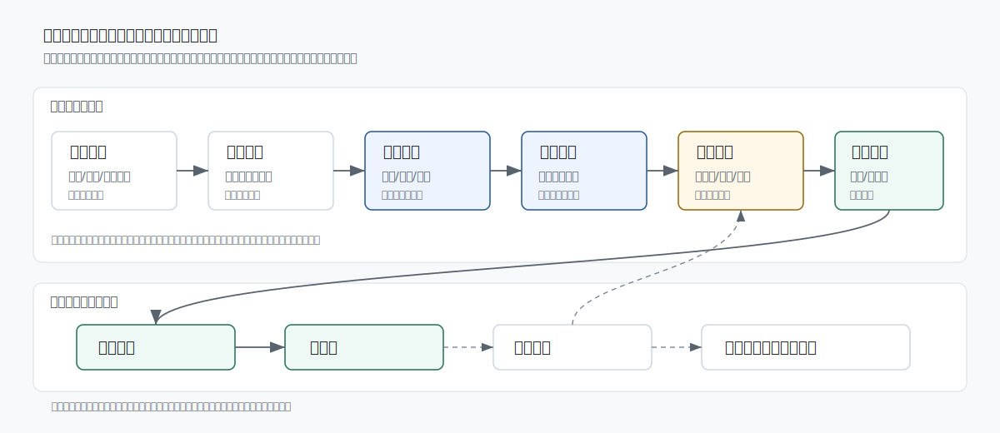

# 面向基础教育作业反馈的人机协同批改框架

以希沃教学场景为对象的独立方案研究

本仓库为概念设计与评测协议，不包含真实学校试点数据，不构成产品效果证明；原型与数据样本均为合成材料。仓库所称“希沃”“视源股份”等仅用于限定研究场景，相关商标归其权利人所有。



## 摘要

基础教育作业批改的主要矛盾并非单纯的判分速度不足，而是教师注意力被大量重复性判断占用后，难以及时进入解释、订正、面批和后续干预。公开政策与行业材料显示，智能批改、作业管理和学情分析已成为教育人工智能的重要方向；同时，教师端真实采用仍受到评分可靠性、证据透明度、学生权益保护和额外复核负担等因素限制。

本研究提出一种基于不确定性分流的人机协同批改框架。系统不以全量无人批改为目标，而将模型输出、置信度、题型风险、历史作答变化和教师复核记录共同纳入决策：低风险样本可进入自动通过或抽样复核，高不确定性样本进入教师复核队列，开放表达、价值判断、识别冲突和疑似严重误判必须保留人工裁量。研究问题为：在不降低评分可靠性与学生权益保障水平的前提下，基于风险分流的人机协同批改能否降低教师净处理时长，并提高反馈后的订正质量？

## 快速阅读路径

- 研究问题与外部证据：[docs/01-problem-and-related-work.md](docs/01-problem-and-related-work.md)
- 系统方法与分流机制：[docs/02-system-method.md](docs/02-system-method.md)
- 评测协议与指标口径：[docs/03-evaluation-protocol.md](docs/03-evaluation-protocol.md)
- 数据治理与伦理边界：[docs/04-ethics-and-governance.md](docs/04-ethics-and-governance.md)
- 合成数据与字段解释：[data/DATA_DICTIONARY.md](data/DATA_DICTIONARY.md)
- 可复现评测输出：[reports/synthetic-evaluation-report.json](reports/synthetic-evaluation-report.json)
- 研究补充材料索引：[reports/research-supplement.md](reports/research-supplement.md)

## 研究边界

本仓库只提供概念系统、评测协议、合成数据样本和可复现指标计算。所有数值结果均用于验证评测管线能否运行，不得解释为模型准确率、减负比例或学习提升的实证结论。真实效果必须在预注册、分集群随机上线、独立盲评金标准和完整数据治理条件下估计。

## 仓库结构

```text
.
├── README.md
├── NOTICE.md
├── index.html
├── REFERENCES.md
├── assets/
│   └── system-architecture.svg
├── docs/
│   ├── 01-problem-and-related-work.md
│   ├── 02-system-method.md
│   ├── 03-evaluation-protocol.md
│   ├── 04-ethics-and-governance.md
│   └── 05-limitations.md
├── data/
│   ├── DATA_DICTIONARY.md
│   ├── dataset-metadata.json
│   └── evaluation-sample.csv
├── reports/
│   ├── research-supplement.md
│   └── synthetic-evaluation-report.json
├── analysis/
│   └── evaluate.py
└── tests/
    └── test_evaluate.py
```

## 方法概述

框架由六个层次组成：作业采集与版面解析、学科题型理解、评分与反馈生成、风险分流与教师复核、订正反馈、再评价。其核心不是让教师退出批改，而是将教师工作从重复确认转向高价值判断：开放题证据核查、误判纠正、共性讲评、个体面批和干预效果复盘。

系统评测采用两阶段设计。阶段A为离线验证：在冻结模型、量表、阈值和评价脚本后，使用校准集确定分流阈值，再在独立测试集上报告教师间一致性、模型相对裁定分的误差、自动通过覆盖率、自动通过错误率、错误捕获率、严重错误逃逸率和复核负担。阶段B为真实教学验证：以教师-作业批次为基本分析单元，采用随机上线顺序或分集群设计，估计教师净处理时长、学生订正质量和延迟保持测验表现。

## 合成样本与复现

合成样本位于 `data/evaluation-sample.csv`。样本仅覆盖少量数学、语文、英语场景，用于展示指标计算和风险分流逻辑。执行以下命令可复现描述性报告：

```bash
python analysis/evaluate.py data/evaluation-sample.csv
python -m unittest discover -s tests -v
```

脚本会始终将 `deployment_authorized` 标记为 `false`，因为合成样本不能用于上线授权。当前样本的一次可复现输出已保存于 `reports/synthetic-evaluation-report.json`。

## 交互原型

`index.html` 为可离线打开的教师复核工作台原型。原型只展示五个匿名合成场景，姓名、班级和作业内容均为虚构；界面中的“记录复核决定”仅改变本地页面状态，不发送数据，也不构成产品功能声明。

## 证据等级

仓库中的资料按以下等级使用：

- 政策与法律文本：用于确定合规边界和公共政策方向。
- 学术文献：用于支撑人机协同、形成性评价、选择性分类和一致性评测方法。
- 媒体访谈：用于归纳用户侧痛点，不作为效果证明。
- 厂商公开材料：用于识别行业能力供给，不作为第三方验证。
- 合成数据：仅用于复现指标计算，不作为真实性能证据。

## 主要文件

- [问题界定与相关研究](docs/01-problem-and-related-work.md)
- [系统方法](docs/02-system-method.md)
- [评测协议](docs/03-evaluation-protocol.md)
- [伦理与治理](docs/04-ethics-and-governance.md)
- [局限性](docs/05-limitations.md)
- [参考文献](REFERENCES.md)
